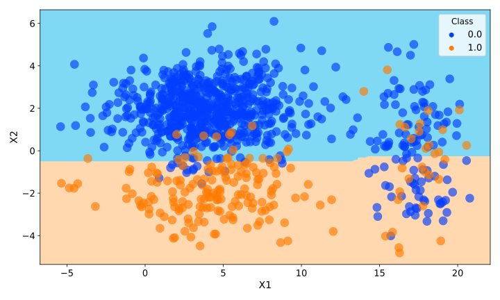

# 3PA - Predictive Performance Precision Analysis

This repository stores the code implemented to generate the Med3PA tool.

## Installation
To have all the requirements needed, you must do the following actions:
- Open a terminal
- Clone this repo: ```git clone https://github.com/Olivier998/3PA.git```
- Move into the directory: ```cd 3PA/```
- Change branch: ``` git checkout dev ```
- Create a virtual environment with conda: ```conda create --name 3paenv ```
- Activate your new environment: ```conda activate 3paenv```
- Instal required packages: ``` pip install -r requirements.txt ```

## Test the tool
You can test the tool using a simulated dataset available in the "data" folder. You can also open the "simulated_data.html" file in a browser to see the result of the 3PA tool applied to the simulated data. Here is a vizualisation of the simulated dataset:


To test the 3PA tool;
- Open a terminal
- Move into the directory: ```cd 3PA/```
- Open the interface: ``` bokeh serve --show interface.py --websocket-max-message-size=500000000 ```

  An app should open in your web browser.
- Click on 'Uplpoad data file' and choose the 'simulated_data.csv' in the "data" folder.
- Click on 'True label' and choose 'y_true'.
- Click on 'Predicted probability' and choose 'pred_prob'
- Click on 'Update Global Results'
- Click on 'Generate MDR tool'

  A new tab should open showing profiles and MDR curves for the simulated Data. 


## Other informations
This repo is at an early stage of developpement. Further documentations and work will be added.
